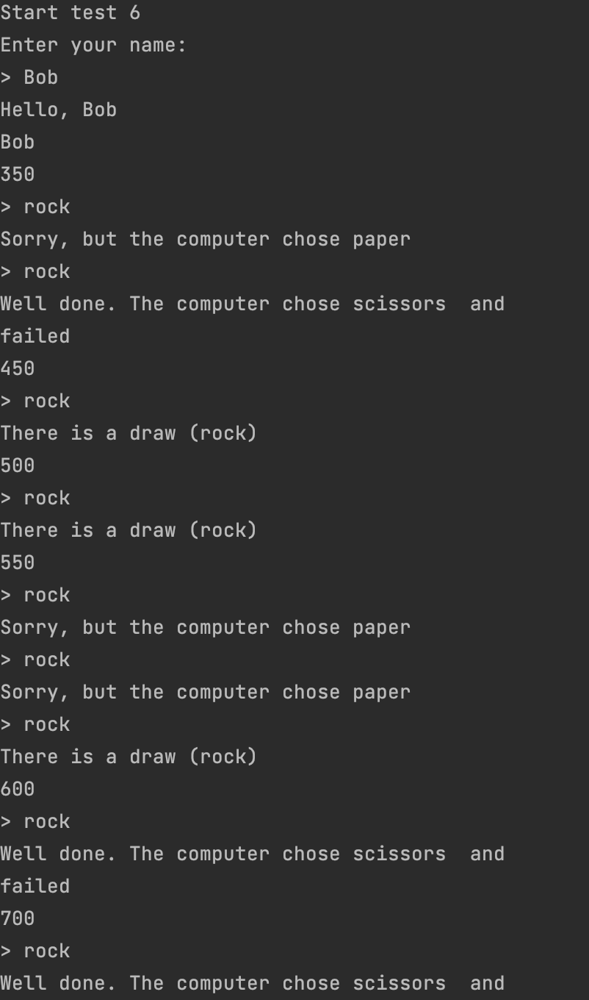

# Rock paper scissors

A classic game recreated with java classes objects user inputs and .txt input of previous scores

## Topics

 - Read and write files form local file path
 - OOP programming with different classes
 - ArrayLists and Arrays manipulation
 - String and Integers manipulation
 - Algorihmic logic and structure for  the game taking it to the next level with list of previoys scores and more options given by the user
  

## Installation

Run -->

Rock-Paper-Scissors/task/src/rockpaperscissors/Main.java
    
## Screenshots

